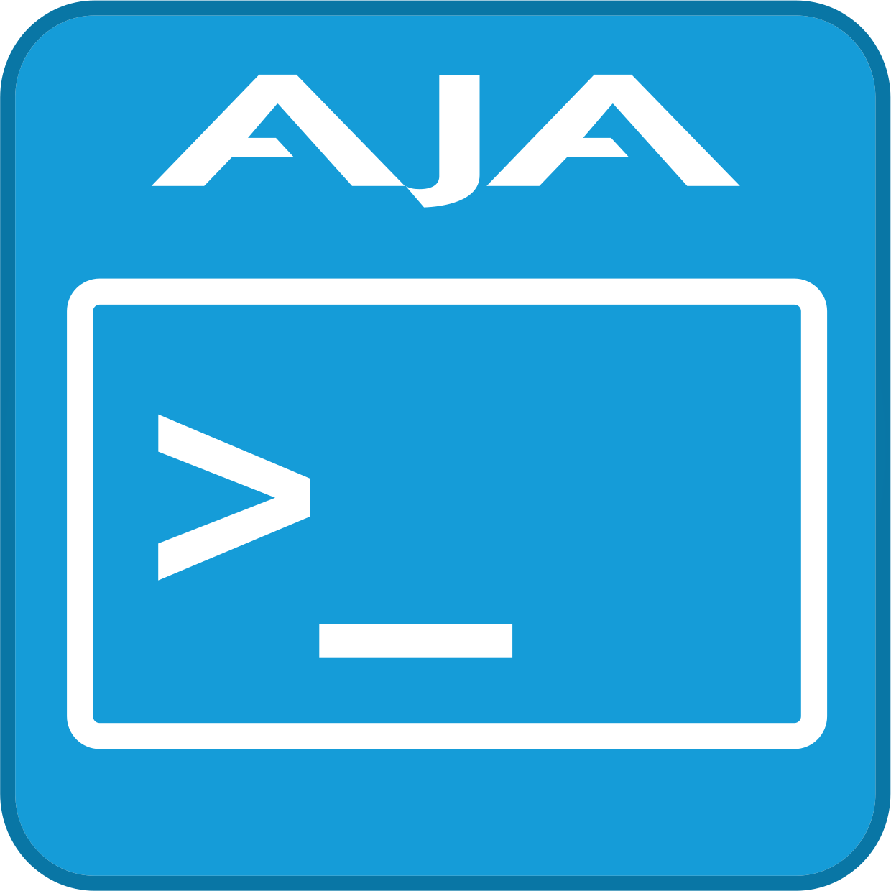

  

# NTV2 Firmware

## Overview 
This is where you can find firmware files for AJA Video's NTV2-based devices.

- Each device or model has its own folder that contains the bitfiles for flashing to said device. 

- Historical (pre-git) changes are kept in a markdown file in the device's folder.

- This repo will be updated with every MAJOR point release for [libajantv2](https://github.com/aja-video/libajantv2) / [NTV2 SDK](https://sdksupport.aja.com/).

**This Repo is intended for advanced users and OEM use only if you are a standard retail user please update you device through our [ControlPanel](https://www.aja.com/products/aja-control-room) application!**

If you are a developer looking to get started with our products, consider enrolling in our [developer program](https://www.aja.com/developer/request).

## Popular Downloads
- KONA X
   - [Retail "X"](https://github.com/aja-video/ntv2-firmware/raw/github-mirror/konax/konax.bit?download=)
   - [Medical "XM"](https://github.com/aja-video/ntv2-firmware/raw/github-mirror/konax/konaxm.bit?download=)
- KONA 5
   - [Retail](https://github.com/aja-video/ntv2-firmware/raw/github-mirror/kona5/tprom/kona5_retail_tprom.bit?download=)
   - [8K](https://github.com/aja-video/ntv2-firmware/raw/github-mirror/kona5/tprom/kona5_8k_tprom.bit?download=)
   - [2x4K](https://github.com/aja-video/ntv2-firmware/raw/github-mirror/kona5/tprom/kona5_2x4k_tprom.bit?download=)
- CORVID 44 12G
   - [8K](https://github.com/aja-video/ntv2-firmware/raw/github-mirror/corvid44-12g/tprom/c44_12g_8k_tprom.bit?download=)
   - [8K MK (mixer keyer)](https://github.com/aja-video/ntv2-firmware/raw/github-mirror/corvid44-12g/tprom/c44_12g_8k_mk_tprom.bit?download=)
   - [2x4K](https://github.com/aja-video/ntv2-firmware/raw/github-mirror/corvid44-12g/tprom/c44_12g_2x4k_tprom.bit?download=)
   - [Planar](https://github.com/aja-video/ntv2-firmware/raw/github-mirror/corvid44-12g/tprom/c44_12g_plnr_tprom.bit?download=)
